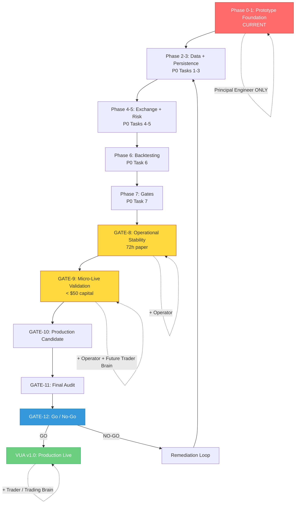

# VUA MASTER PROJECT MAP

Root inspected: /root/projects/VUA-Trading-Agent (read-only audit).
Highest-level project map. Answers 13 mandatory questions. Contains Mermaid roadmap.

---

## 1. Where Are We Now?

**Phase:** Prototype Foundation (Phase 0-1 of blueprint).
**Hermes Role:** Principal Engineer ONLY.
**Audit State:** Read-only reconciliation complete. No source code modified.
**Documentation:** Audit documents updated. **ADR-001 APPROVED** (Hybrid TypeScript + Optional Python). 25 gaps catalogued (7 P0, 7 P1, 6 P2, 5 P3). 25 executable tasks planned. 13 health gates defined.

**Approved Architecture Principle:** "AI may propose. Deterministic Risk Governor decides whether execution is permitted." — Risk Governor remains outside LLM/AI authority.

---

## 2. What Is Actually Implemented?

| Component | Status | Evidence |
|-----------|--------|----------|
| Multi-agent debate (5 agents) | PROTOTYPE | `server/services/multiAgentBrain.ts` |
| Risk engine (Hard Veto, 8 checks) | IMPLEMENTED (in-memory) | `server/services/riskEngine.ts` |
| Regime classification (8 types) | IMPLEMENTED | `server/services/regime.ts` |
| Technical indicators (EMA/RSI/ATR/BB/MACD) | IMPLEMENTED | `server/services/indicators.ts` |
| Gemini LLM client with circuit breaker | PROTOTYPE | `server/services/geminiClient.ts` |
| Exchange REST clients (Binance, Bybit) | PROTOTYPE (with synthetic fallback) | `server/services/binance.ts`, `bybit.ts` |
| Execution engine (paper + live stub) | PARTIAL | `server/services/executionEngine.ts` |
| API routes (15 endpoints + SSE) | IMPLEMENTED (in-memory) | `server/routes/api.ts` |
| Memory ledger with seeded history | PROTOTYPE | `server/services/memoryLedger.ts` |
| Research lab + backtest + post-mortem | PROTOTYPE (synthetic data) | `server/services/researchLab.ts` |
| React frontend (9 components) | IMPLEMENTED (UI prototype) | `src/components/*.tsx` |

---

## 3. What Is Prototype?

- **All execution logic** — paper mode works, live mode is stub
- **All exchange clients** — synthetic fallback masks real failures
- **All backtesting** — runs on synthetic candles only
- **All audit/history** — in-memory only, lost on restart
- **Multi-agent debate** — works with Gemini API but no persistent log
- **Live credentials** — stored in memory, not used for HMAC signing
- **Kill switch** — works for paper mode only

---

## 4. What Is Missing?

**P0 (Blocking):**
- Database persistence (GAP-002)
- Synthetic fallback removal (GAP-003)
- WebSocket exchange integration (GAP-004)
- Risk engine audit trail (GAP-005)
- Historical data for backtesting (GAP-006)
- CI/CD health gate enforcement (GAP-007)
- Language/stack decision (GAP-001)

**P1 (Major):**
- Reconciliation engine (GAP-101)
- Secret management (GAP-102)
- Comprehensive risk tests (GAP-103)
- Persistent debate log (GAP-104)
- Full order book depth + quality score (GAP-105)
- Funding rate in risk sizing (GAP-106)
- Independent sizing validator (GAP-107)

**P2 + P3:** 11 additional gaps (see 23-master-gap-list.md)

---

## 5. What Architectural Decisions Remain?

**ADR status: 1 APPROVED, 8 PROPOSED/PENDING:**

| ADR | Topic | Status |
|-----|-------|--------|
| ADR-001 | TypeScript vs Python core | **APPROVED** — Hybrid (TS core + optional Python worker) |
| ADR-002 | Database (PostgreSQL) | **APPROVED** — Dual-Profile (SQLite Android / PostgreSQL 16 production); **P0-002-A SQLite Profile A = PASS**; **P0-002-B PostgreSQL Profile B = AWAITING U1 AUTHORIZATION** — forensic audit determined full UUID contract required; Option B minimal scope insufficient; see `docs/audit/44-p0-002-b-u1-full-uuid-contract-authorization.md` |
| ADR-003 | Exchange abstraction (interface + ccxt) | PROPOSED — Handoff prepared in `32`; awaiting ADR-002 approval + exchange selection |
| ADR-004 | Execution architecture (paper → testnet → live) | PROPOSED |
| ADR-005 | AI orchestration (Gemini + deterministic fallback) | PROPOSED |
| ADR-006 | Persistence (CRUD + event log) | PROPOSED |
| ADR-007 | Backtesting architecture | PROPOSED |
| ADR-008 | Market data (WebSocket + REST fallback) | PROPOSED |
| ADR-009 | Deployment (Docker Compose) | PROPOSED |

**No decisions APPROVED. All require explicit human approval.**

---

## 6. What Must Be Built First?

**Dependency Order (top of chain):**

```
TASK-P0-001 (Language Decision)
       ↓
TASK-P0-002 (PostgreSQL Schema)
       ↓
TASK-P0-003 (Data Foundation — remove synthetic fallback)
       ↓
TASK-P0-004 (Exchange Adapter + WebSocket + Reconciliation)
       ↓
TASK-P0-005 (Risk Engine Persistence)
       ↓
TASK-P0-006 (Backtesting Engine)
       ↓
TASK-P0-007 (Health Gates CI/CD)
       ↓
... P1, P2, P3 tasks in parallel where possible
```

**Critical Path:** 7 P0 tasks must complete sequentially before any production work.

---

## 7. What Blocks What?

| Blocker | Blocked Tasks |
|---------|---------------|
| ADR-001 not approved | TASK-P0-002 through TASK-P0-007 (all P0) |
| TASK-P0-002 (DB) not done | TASK-P0-005, TASK-P0-006, GAP-101, GAP-104, GAP-106 |
| TASK-P0-003 (no synthetic) not done | TASK-P0-006 (backtesting needs real data) |
| TASK-P0-004 (exchange adapter) not done | TASK-P0-006 (backtest live), TASK-P0-007 (micro-live) |
| TASK-P0-005 (risk audit) not done | GAP-101, GAP-106, GAP-107 |
| TASK-P0-006 (backtest) not done | TASK-P0-007 (micro-live validation) |
| TASK-P0-007 (gates) not done | Any production deployment |

---

## 8. What Validates Each Component?

**See 28-health-gates.md for full validation criteria.**

| Gate | Validates |
|------|-----------|
| GATE-0 | Repository understood by agent |
| GATE-1 | Architecture decisions baseline |
| GATE-2 | Core system functional |
| GATE-3 | Testing baseline |
| GATE-4 | Risk boundary verified |
| GATE-5 | Exchange integration verified |
| GATE-6 | Backtest validated |
| GATE-7 | Paper trading stable |
| GATE-8 | Operational stability |
| GATE-9 | Micro-live validation |
| GATE-10 | Production candidate |
| GATE-11 | Final audit |
| GATE-12 | Go / No-Go decision |

**Each gate requires evidence artifact. No bypass paths.**

> **No-Dummy / No-Halu Gate:** Production-critical path MUST NOT depend on synthetic candles, fake exchange, fake fills, mocked execution, hardcoded balances, or placeholder risk (see `docs/audit/31-testing-acceptance-strategy.md` — Section 14: No-Dummy / No-Halu Gate; mocks only permitted in controlled test environments — unit/integration tests only; never in production). Synthetic fallback must have explicit dev-mode flag (`NODE_ENV=development`) and must be impossible to enter in production.

> **Promotion Gates:** Paper Gate → Testnet Gate → Controlled Live Gate → Final Production. Each promotion requires objective PASS/FAIL criteria (see `docs/audit/31-testing-acceptance-strategy.md` — Section 12 (PAPER GATE), Section 13 (TESTNET GATE), Section 15 (NO-DUMMY / NO-HALU GATE), Section 16 (DEFINITION OF DONE / LIVE READINESS))). No bypass permitted. Gate failure blocks promotion.

---

## 9. What Constitutes a Healthy VUA?

A healthy VUA has:

- **Persistent state** — PostgreSQL with all tables populated, no in-memory state
- **Real data** — Zero synthetic data in production path; explicit dev-mode flag for synthetic (see `docs/audit/31-testing-acceptance-strategy.md` — Section 15: NO-DUMMY / NO-HALU GATE; production-critical paths MUST NOT depend on synthetic candles, fake fills, mocked order execution, or placeholder risk; mocks only permitted in controlled test environments — Sections 1–2 (Unit + Integration) only; never in production)
- **Testnet validated execution** — Orders placed, filled, reconciled on testnet (see `docs/audit/31-testing-acceptance-strategy.md` — Paper Gate → Testnet Gate → Controlled Live Gate promotion chain; promotion requires objective PASS/FAIL criteria at each stage; no bypass permitted)
- **Risk boundary enforced** — 100% veto coverage tested, audit log queryable
- **Backtesting on real data** — Deterministic, reproducible, OOS-validated
- **Paper trading stable** — 50+ paper trades, all risk-checked, no anomalous fills
- **Operational stability** — 72h continuous uptime, secret rotation, alerts firing
- **Micro-live validated** — Real capital < $50, all checks functional under real conditions
- **All health gates passed** — GATE-0 through GATE-12 with evidence artifacts
- **Independent audit** — External auditor sign-off

---

## 10. When Can Hermes Become Operator?

**Hermes transitions to Principal Engineer + Operator when:**

1. GATE-8 (Operational Stability) passed with evidence
2. GATE-9 (Micro-Live Validation) passed with evidence
3. Human Operator role explicitly assigned by institutional stakeholders
4. All P0-P1 tasks have acceptance criteria met

**Required evidence:**
- `docs/audit/gate-evidence/gate-8-operational-stability.md`
- `docs/audit/gate-evidence/gate-9-micro-live-validated.md`
- Human sign-off document authorizing Operator role
- Operator runbook signed by Principal Engineer

---

## 11. When Can Hermes Become Trader?

**Hermes transitions to Trader / Trading Brain when:**

1. GATE-9 (Micro-Live Validation) passed
2. Human explicit approval from institutional stakeholders
3. Operator role already active
4. Risk boundary fully validated under live micro-capital

**Trader Brain MUST NOT be developed before this transition.** No neural/LLM trading architecture before GATE-9.

---

## 12. What Is the Final Production Gate?

**GATE-11 (Final Audit)** is the final production gate.

- Independent external auditor review
- All P0-P1 acceptance criteria verified
- All architecture decisions APPROVED with signatures
- Full system compliance matrix complete
- Risk assessment finalized

**GATE-12 (Go/No-Go)** is the final decision gate.

---

## 13. What Is the Exact Finish Line?

**VUA v1.0 is shipped when:**

1. GATE-12 (Go/No-Go) decision = **GO**
2. Production deployment completed with all services running
3. All health gates have evidence artifacts in `docs/audit/gate-evidence/`
4. All P0-P1 tasks have acceptance criteria met
5. Architecture decisions approved
6. Independent audit report signed
7. Stakeholder committee sign-off
8. Go-live checklist completed

**Exact finish line:** Production deployment succeeds. Hermes operating as Trader/Trading Brain. Real capital deployed (capped per micro-live validation results). System monitored 24/7. Zero anomalous fills. Zero risk veto bypasses. Zero silent divergences.

---

## VISUAL ROADMAP



---

## KEY DATES / MILESTONES

| Milestone | Target |
|-----------|--------|
| All P0 tasks completed | Post-ADR-001 approval |
| GATE-8 passed | 72h continuous paper trading |
| GATE-9 passed | Micro-live < $50 capital stable |
| GATE-12 GO decision | VUA v1.0 production live |

---

## NEXT REQUIRED HUMAN DECISION

**Primary blocker (RESOLVED):** ADR-001 — TypeScript vs Python core. **APPROVED** 2026-08-31: Hybrid (TypeScript core + optional Python worker).

**Current blocker:** ADR-002 — PostgreSQL database confirmation.

With ADR-001 APPROVED:
- TypeScript = mandatory core (Execution, Risk, Position, Reconciliation, Exchange, Market Data, Regime)
- PostgreSQL = confirmed target DB (next decision: ADR-002)
- Python = optional/future (research/ML), NOT required for core start

**Secondary blocker:** ADR-002 — PostgreSQL confirmation.

After ADR-001, database choice must be confirmed.

**Tertiary blocker:** ADR-003 — Exchange abstraction approach.

After ADR-002, exchange adapter design finalized.

---

## STOP CONDITION

This reconciliation does NOT begin implementation. Source code is unchanged. Trading behavior is unchanged. Exchange behavior is unchanged. Dependencies are unchanged.

**Hermes stops here and waits for human review of:**
1. 20-blueprint-reconciliation.md
2. 21-roadmap-reconciliation.md
3. 22-architecture-decisions.md
4. 23-master-gap-list.md
5. 24-engineering-dependency-order.md
6. 25-master-work-breakdown.md
7. 26-hermes-role-gates.md
8. 28-health-gates.md
9. 27-vua-master-project-map.md (this file)

**No implementation until explicit human approval of these documents.**

Date of audit reconciliation: $(date -u +"%Y-%m-%dT%H:%M:%SZ")
